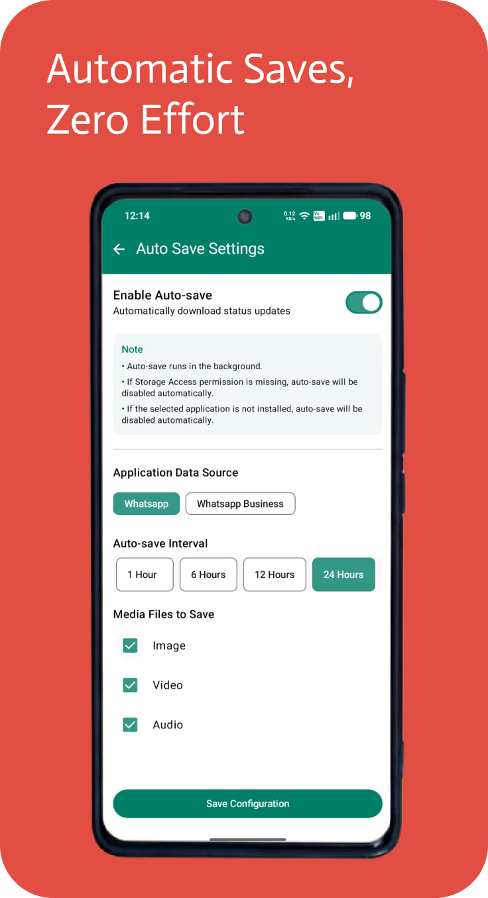

# WaStatusSaver

A high-performance Android utility designed to permanently save WhatsApp and WhatsApp Business statuses in their original quality. This application eliminates the 24-hour expiration barrier with an advanced background automation engine.

## 🚀 Key Features

* **Multi-Format Support**: Seamlessly save status updates in **Audio, Video, and Image** formats.
* **Zero Compression**: Files are copied directly from the source cache, ensuring **Original Quality** with no pixel loss.
* **Instant Saving**: One-tap manual saving that reflects in your gallery immediately.
* **Dual Source Support**: Easily toggle and save media from both **WhatsApp** and **WhatsApp Business**.

## Screenshots

    
    
    
    

## 🤖 Advanced Auto-Saving Feature

The standout feature of this application is the **Automation Suite**, which runs silently in the background without user intervention or the need for the app to be in the foreground.

* **Configurable Intervals**: Set the background sync to run every **1, 6, 12, or 24 hours**.
* **Data Source Selection**: Choose between WhatsApp or WhatsApp Business as the primary source.
* **Targeted Saving**: Filter exactly what to auto-save (Images, Videos, or Audio) to optimize storage.
* **Set & Forget**: Once the configuration is saved, the app handles all future updates automatically.

## 📁 Organized File Architecture

The application maintains a clean and professional directory structure within your local storage to ensure your media is accessible to all gallery applications:

`Internal Storage / Download / WaStatusSaver /`
* 📂 **Images** - High-resolution photos.
* 📂 **Videos** - Full-quality video clips.
* 📂 **Audio** - Voice notes and audio updates.

## 🛠️ Technical Implementation

* **Background Processing**: Uses modern Android architecture to trigger saves at specific intervals even when the device is idle.
* **Scoped Storage Compliant**: Designed to work with the latest Android permission models.
* **Privacy-First**: Operates entirely on-device; no media is ever uploaded or shared externally.

---

## 📜 Disclaimer
*This app is not affiliated with, sponsored, or endorsed by WhatsApp Inc. "WhatsApp" is a trademark of WhatsApp Inc.*
