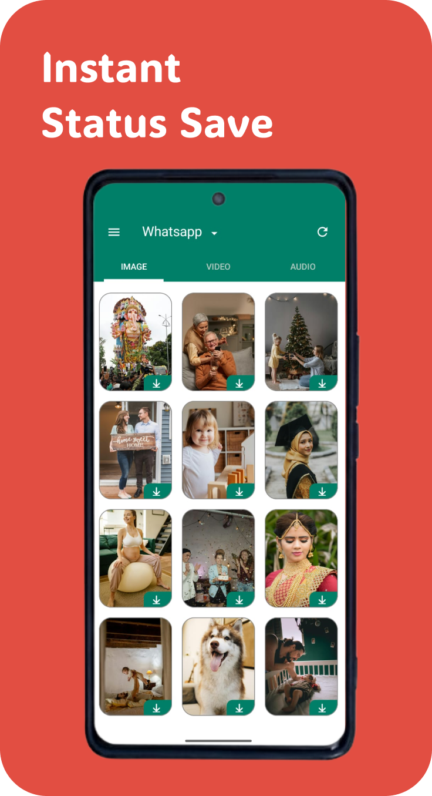
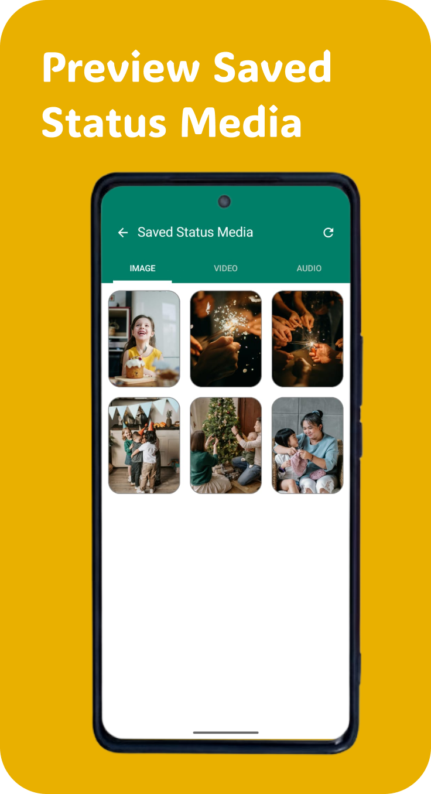
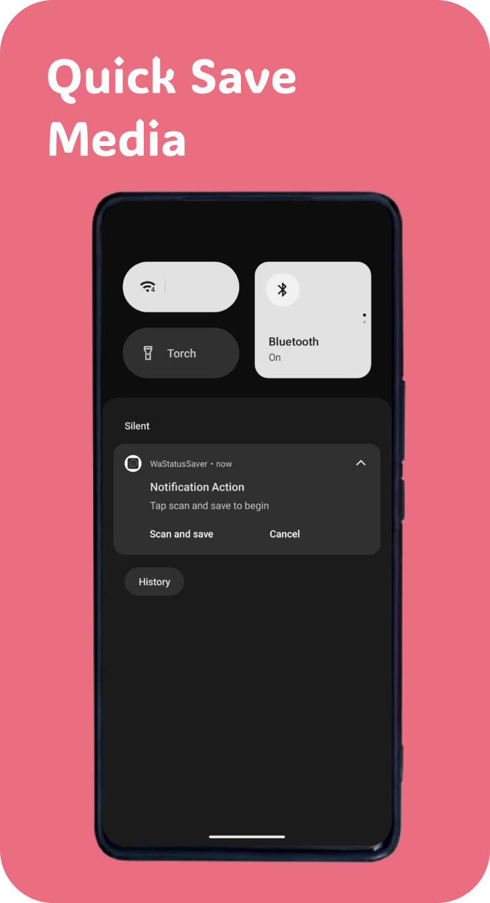
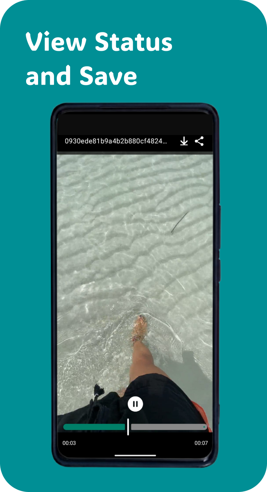

# 📥 WaStatusSaver

A high-performance Android utility designed to permanently save **WhatsApp** and **WhatsApp Business** statuses in their original quality. This application helps you preserve disappearing media with a fast, privacy-focused, and on-device experience. 🚀

### Get From
> 
> 

---

## ✨ Key Features

* 🎼 **Multi-Format Support**: Seamlessly save status updates in **Audio, Video, and Image** formats.
* 💎 **Zero Compression**: Files are copied directly from the source cache, ensuring **Original Quality** with no pixel loss.
* 🔔 **Quick Save from Notification**: Save status media instantly with a single tap directly from the notification, without opening the app.
* 🔄 **Dual Source Support**: Easily toggle and save media from both **WhatsApp** and **WhatsApp Business**.
* 🎯 **Media-Type Filtering**: Filter quick save by **Images, Videos, or Audio** based on your preference.

---

## 📸 Screenshots

  
  
  
  

---

## 🔔 Smart Quick Save Experience

WaStatusSaver makes status saving faster by bringing actions directly to the notification panel.

* ⚡ **Single-Tap Saving**: Save media instantly from the notification without launching the application.
* 📲 **Source Selection**: Choose between **WhatsApp** and **WhatsApp Business** as the source.
* 🎯 **Filtered Quick Save**: Control what appears for quick save by selecting **Images, Videos, or Audio**.
* ✅ **Faster Workflow**: Reduce manual steps and save statuses the moment they are detected.

---

## 📁 Organized File Architecture

The application maintains a clean and professional directory structure within your local storage:

`📂 Internal Storage / Download / WaStatusSaver /`
* 🖼️ **Images** - High-resolution photos.
* 🎬 **Videos** - Full-quality video clips.
* 🎵 **Audio** - Voice notes and audio updates.

---

## 🛠️ Technical Implementation

* ⚙️ **Foreground Service Based Flow**: Supports quick interactions through notifications for a faster saving experience.
* 🛡️ **Scoped Storage Compliant**: Designed to work with the latest Android permission models.
* 🔒 **Privacy-First**: Operates entirely on-device; no media is ever uploaded or shared externally.

---

## ⚖️ License
This project is licensed under the **GNU Affero General Public License v3.0 (AGPL-3.0)**. See the [LICENSE](LICENSE) file for details.

---

## 📜 Disclaimer
*This app is not affiliated with, sponsored, or endorsed by WhatsApp Inc. "WhatsApp" is a trademark of WhatsApp Inc.*